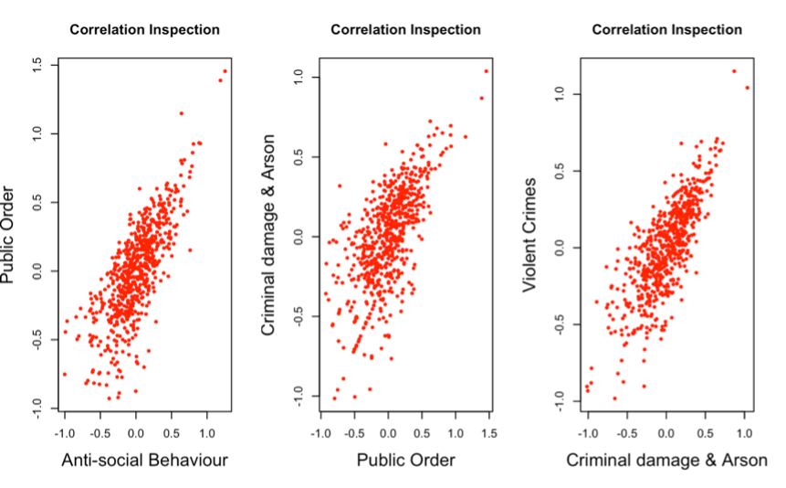

# Crime Analysis in Derbyshire 2019

# SECTION 1
## 1.1.	DATASET DESCRIPTION
A geographic hierarchy called Lower Layer Super Output Areas (LSOA) was created to enhance the reporting of local area statistics in England and Wales. They are constructed from collections of adjacent Output Areas that were automatically formed to have a population size as uniform as possible. Generally, they contain four to six Output Areas. The average population is 1500, and the least population is 1000 for an LSOA. The dataset consists of crimes reported in each LSOA in Derbyshire, the information in the data is divided into 315 regions, including 48 regions in Bolsover, 59 regions in High Peak, 69 regions in Chesterfield, 78 regions in Amber Valley, 73 regions in Erewash. The dataset consists of 14 crime variables linked to statistics on the number of people and the size of the land area (in hectares) for each of the 642 regions in Derbyshire, which all occurred in 2019.

## 1.2.	VARIABLES IN THE DATASET
The dataset has a total of 18 variables and 642 observations describing the contents of the data, the following are the variables:

| Sn  | VARIABLE                  | DESCRIPTION                                                                                                                                                             |
|-----|---------------------------|-------------------------------------------------------------------------------------------------------------------------------------------------------------------------|
| 1   | LSOA                      | This is the unique identification number (code) of the region that falls under the specific LSOA in Derbyshire as a whole. This code can be used to find postcode information about the region in question from sources like www.doogal.co.uk. |
| 2   | Name                      | This is the specific name of the region in question which can also be used to get postcode information about the region.                                                 |
| 3   | Population                | This is the number of all the inhabitants in the specific region. This can be used to understand how many people live in the region and how that can affect a pattern of crime in the region. |
| 4   | Land Area in Hectares     | This variable specifies the land mass of the region in hectares. This can be used to know the number of hectares the region has and see how this affects other variables like the population or the crime rate in the region. |
| 5   | Anti-Social Behaviour     | This is the number of crimes related to a person’s actions that bother, scare, or distress people who are not in their family in the region.                              |
| 6   | Burglary                  | This is the number of crimes related to the unlawful entry of a building with the intention of committing a crime, mostly theft in the specific region.                  |
| 7   | Robbery                   | This variable shows the number of crimes related to the act of illegally taking property from a person or location through violence or the threat of violence in the region. |
| 8   | Vehicle Crimes            | This variable gives the total number of crimes in relation to vehicle theft, car trafficking, and illegal trading of spare parts in the region.                         |
| 9   | Violent Crimes            | This is the number of crimes involving a perpetrator or offender who uses harmful force on a victim or makes a threat to do so in the region.                           |
| 10  | Shoplifting               | This is the number of crimes involving the practice of taking merchandise from a shop while posing as a customer in the region.                                          |
| 11  | Criminal Damage & Arson   | This variable specifies the number of crimes from the occurrence of wilful, purposeful harm done to a home, other pieces of property, or vehicles, and the purposeful setting of fire to objects of property, including houses and cars in the region. |
| 12  | Other Theft               | This variable shows the number of crimes relating to other thefts that occurred but were not specified in the region.                                                    |
| 13  | Drugs                     | This is the number of drug-related crimes in the region.                                                                                                                |
| 14  | Other Crimes              | This is the number of other crimes in the region that were not specified in the other variables.                                                                         |
| 15  | Bike Theft                | This is the number of crimes concerning the stealing of bikes in the region.                                                                                            |
| 16  | Possession of Weapons     | This is the number of crimes involving the unlawful possession of weapons in the region.                                                                                 |
| 17  | Public Order              | This is the number of crimes that hinder people’s capacity for effective functioning and society’s ability to run smoothly in the region.                                |
| 18  | Theft from the Person     | This is the number of crimes involving the stealing of possessions from a person.                                                                                       |

The following additional variables were introduced into the dataset to ensure a more concise description of the information:

| Sn  | VARIABLE                    | DESCRIPTION                                                                                                                                                           |
|-----|-----------------------------|-----------------------------------------------------------------------------------------------------------------------------------------------------------------------|
| 19  | District                    | This is the district which the different LSOA fall under. This is necessary to get better detailed information on all the LSOA under the district. The dataset consists of 9 districts named Amber Valley, Bolsover, Chesterfield, Derby, Derbyshire Dales, Erewash, High Peak, North East Derbyshire, and South Derbyshire. |
| 20  | Total Crime                 | This variable shows the total number of crimes in each region.                                                                                                         |

## 1.3.	UTILIZATION OF THE DATASET
This dataset provides a good amount of data involving population, land mass and crimes across 642 regions in Derbyshire, a county in the East Midlands part of the United Kingdom. This data can be effectively used to understand the patterns and trends of crime in Derbyshire, identify if the number of crimes is linked to other factors such as the population or land mass in the region, as well as develop models which show a correlation in some of these crimes and coin ideas which can reduce the occurrence of these crimes, as a result of these analyses.

## 1.4.	SUMMARY STATISTICS
The dataset has 3 character variables and 17 numeric variables, the summary statistics of the numeric variables are
 illustrated below.

| VARIABLE                | MINIMUM | 1ST QUARTILE | MEDIAN | MEAN   | 3RD QUARTILE | MAXIMUM  | STANDARD DEVIATION| SKEWNESS | KURTOSIS   |
|-------------------------|---------|--------------|--------|--------|--------------|----------|-------------------|----------|------------|
| Population              | 993     | 1,411        | 1,584  | 1,657  | 1,815        | 3,948    | 374.138           | 1.717    | 8.086      |
| Land Area in Hectares   | 12.81   | 37.26        | 71.56  | 408.84 | 209.55       | 16,227.09| 1,115.23          | 6.831    | 73.961     |
| Anti-social Behaviour   | 3       | 22           | 36     | 52.35  | 58           | 1,359    | 73.946            | 10.282   | 162.681    |
| Burglary                | 1       | 5            | 8      | 10.25  | 13           | 158      | 9.076             | 7.569    | 112.648    |
| Robbery                 | 1       | 1            | 1      | 2.162  | 2            | 79       | 3.945             | 13.302   | 236.829    |
| Vehicle Crimes          | 1       | 5            | 8      | 9.344  | 12           | 60       | 6.565             | 2.43     | 13.912     |
| Violent Crimes          | 3       | 22           | 35     | 49.9   | 58           | 1,280    | 63.812            | 11.888   | 218.413    |
| Shoplifting             | 1       | 1            | 1      | 9.727  | 5            | 613      | 32.71             | 11.644   | 191.812    |
| Criminal Damage & Arson | 1       | 7            | 12     | 14.86  | 19           | 196      | 13.664            | 5.2      | 56.456     |
| Other Theft             | 1       | 5            | 8      | 11.91  | 13           | 382      | 19.133            | 12.471   | 225.154    |
| Drugs                   | 1       | 2            | 3      | 4.668  | 5            | 150      | 9.166             | 10.67    | 145.265    |
| Other Crimes            | 1       | 2            | 3      | 3.829  | 5            | 46       | 3.653             | 5.389    | 52.893     |
| Bike Theft              | 1       | 1            | 1      | 2.545  | 2            | 170      | 7.321             | 19.145   | 429.384    |
| Possession of Weapons   | 1       | 1            | 2      | 2.218  | 3            | 60       | 2.886             | 13.318   | 254.466    |
| Public Order            | 1       | 4            | 7      | 10.57  | 11.75        | 404      | 20.161            | 13.474   | 240.535    |
| Theft from the Person   | 1       | 1            | 1      | 2.218  | 2            | 202      | 8.573             | 20.571   | 466.755    |
| Total Crime             | 21      | 94           | 134.5  | 186.6  | 202.5        | 5,159    | 254.541           | 12.826   | 234.413    |

Note the following from the table above: 
- The Mean and Median of each variable are different due to some outliers in the variable.
- The Standard Deviations(SD), Skewness and Kurtosis of these variables were not obtained from the summary statistics table.
- When the SD is larger, the data points are more apart from the mean, and when it is smaller, the data points are closer together around the mean. For example, this means that the points of “Possession of Weapons”, which has an SD of 2.886, are closer to the mean compared to the points of “Land Area in Hectares”, which has an SD of 1,115.232.
- If the Skewness is positive, the distribution is skewed to the right. All numeric variables are skewed to the right.
- From the Kurtosis results, variables with higher kurtosis, like “Theft from the person”, have a more peaked distribution compared to variables with lower kurtosis, like “Vehicle crimes”.

## 1.5.	RELEVANT PLOTS
The following are relevant plots that show some descriptive information about the dataset. 

A. 
_Figure 1. Histogram showing Crime frequency._

Figure 1 is a histogram that shows the frequency of all the crimes in the whole of Derbyshire in 2019. This can be used to understand how often different crimes occur. From the bar chart, “Anti-Social Behaviour” was the most occurring crime while Robbery occurred the least.

B. 
_Figure 2. Pie chart showing the population of each district._

Figure 2 is a pie chart that shows the population of each district and from this, “Derby” is the most populated district while “Derbyshire Dales” has the least population.

C. 
_Figure 3. Histogram showing the number of crimes in each district._

Figure 3 is a histogram that shows the frequency of all crimes in each district. From this, the “Derby” district has the most crimes, which is not surprising since it is the most populated district. Also, “Derbyshire Dales”, being the least populated district has the least occurrence of crime.

D. 
_Figure 4. Treemap showing the land mass of each district._

Figure 4 is a treemap that shows the land mass by hectares of each district. “Derbyshire Dales” has the most land mass from this tree map.

# SECTION 2
## 2.1.	LINEAR REGRESSION
Linear regression models were done for all the crimes, with the crime densities as the dependent variables and the population densities as the independent variables.
Note the following:
- The densities were used because they serve as better predictors for the models and give more precise values.
- A log transformation was used in all the models because the original relationships between the predictor and response variables weren’t linear and it makes them more linear, condenses the data, and makes the model more accurate.
- All 0 values were transformed to 1 so the log transformations wouldn’t be invalid.

Recall, the equation of linear regression is y = β₀ + β₁x+ ε
where y is the dependent variable, x is the independent variable, β₀ is the intercept (also known as the y-intercept or constant), and β₁ is the slope (also known as the regression coefficient) ε is the error term for the observation.
The intercept (β₀) is the value of y when x is zero. It represents the starting point or baseline of the regression line.
The slope (β₁) is the change in y for every unit change in x. It represents the rate of change or the steepness of the regression line.

Here’s a table showing the intercept and slope of the linear regression models for all the crime densities:

| VARIABLE                  | INTERCEPT (β₀) | SLOPE (β₁) | STANDARD ERROR | P-VALUE |
|---------------------------|----------------|------------|----------------|---------|
| Anti-social Behaviour      | -1.82146       | 1.14829    | 0.02075        | <2e-16  |
| Burglary                   | -2.30167       | 1.00289    | 0.01807        | <2e-16  |
| Robbery                    | -3.18957       | 1.14904    | 0.01698        | <2e-16  |
| Vehicle Crimes             | -2.35954       | 1.02457    | 0.01766        | <2e-16  |
| Violent Crimes             | -1.87080       | 1.18624    | 0.01945        | <2e-16  |
| Shoplifting                | -2.95277       | 1.14475    | 0.03711        | <2e-16  |
| Criminal Damage & Arson    | -2.30629       | 1.12458    | 0.01996        | <2e-16  |
| Other Theft                | -2.30958       | 1.00335    | 0.02234        | <2e-16  |
| Drugs                      | -2.84592       | 1.08812    | 0.02268        | <2e-16  |
| Other Crimes               | -2.83232       | 1.07552    | 0.01923        | <2e-16  |
| Bike Theft                 | -3.15880       | 1.14374    | 0.01898        | <2e-16  |
| Possession of Weapons      | -3.08451       | 1.09586    | 0.01685        | <2e-16  |
| Public Order               | -2.53849       | 1.14124    | 0.02258        | <2e-16  |
| Theft from the Person      | -3.13702       | 1.07455    | 0.01738        | <2e-16  |

*INTERPRETATION*
-	The P-Values of all models are less than 0.05, which shows that the models are statistically significant.
-	The Standard Errors of all models are significantly low (closer to 0), which shows that models have a good fit to the data, which implies that the predictions made by the models are more accurate.  
-	The intercepts are all negative, but the slopes are positive, this means that the regression lines intersect the y-axis below the origin (at a negative value of y) and slope upward from left to right. Hence, they all seem to have positive linearities but a visual representation will throw more light on this. 
-	Since all the intercepts are greater than 1, there may be diseconomies of scale at play here. This means that diseconomies of scale could be interpreted as the increase in the crime rate per unit increase in population as the population grows larger. A visual representation would be best to confirm this assumption.

### LINEAR REGRESSION VISUALS

_Figure 5. Scatterplots showing the linear regression models._

*INTERPRETATION*
Figure 5 represents the visuals for the regressions of all the crimes in Derbyshire, in 2019 showing the relationship between the crime densities and population densities. All the regression models are linear and have positive linearity from these visuals. This means that as the population density increases, crime density also increases. According to the figure, the increase in population density gives an increase in crime rate density, this suggests that there are diseconomies of scale at play. This could mean that as the population grows larger, the resources needed to maintain law and order become stretched, making it more difficult to prevent crime and leading to an increase in the crime rate. There is also a possibility of heteroscedasticity in these models, but a constant variance check will confirm this.

_Figure 6. Histograms showing the frequency of each residual with a density curve and a normal curve._

*INTERPRETATION*
Figure 6 are histograms showing the frequency of all residuals of the linear regression models of all crimes. The blue curve shows the distribution of the densities of these residuals while the red curve shows the distribution of the densities of a normally distributed variable, this was included as a guide to test for the normality of the densities of these residuals. From this, all the residuals are normally distributed except those of “Shoplifting”, “Drugs”, “Other Crimes”, “Theft from the Person”, “Bike Theft” and “Possession of weapons” since their blue curves do not have a bell shape like the red curves.

### INDEPENDENCE VISUALS

_Figure 7. Scatterplots to check for Independence._

*INTERPRETATION*
If the scatter plots have a pattern in the spread of their points, the residuals are said to have some sort of dependence but in this case, all scatter plots in Figure 7 lack a pattern in the spread of their points, this shows that the residuals of all the crimes are independent.

### CONSTANT VARIANCE VISUALS

_Figure 8. Scatterplots to check for Constant Variance_

*INTERPRETATION*
Constant variance suggests that the variability of the data points' range of values is essentially the same. Constant variance is one in which the distribution of the dots (or points), on a dot plot, over the mean is essentially uniform. The assumption of constant variance does not hold for any of the residuals in Figure 8 because they lack a uniform scatter across their means. That is, the residuals of the regression models are not constant across all levels of the predictor variables. They are said to be heteroscedastic, which confirms the earlier claim.

## 2.2.	CORRELATION
After computing and storing the residuals in a data frame called Residuals, the scatterplots to check the correlation of all the residuals (Appendix 1.) were too small and not visible, and this was a limitation in inspecting the correlation of all 14 sets of residuals. So, I plotted scatterplots of 3 residuals in Figure 9 below to inspect their correlation.

### CORRELATION VISUALS

_Figure 9. Scatterplots of residuals to inspect correlation._

*INTERPRETATION*
The scatterplots in Figure 9 show that there is a correlation between these residuals as their scatterplots have some sort of pattern and the points are not randomly distributed.

### HEATMAP

_Figure 10. Heatmap of Residuals._

*INTERPRETATION*
The residuals' correlation is displayed on the heatmap. The heatmap's scale runs from 0.4 to 1.0, with 0.4 representing the lowest correlation and 1.0 representing the highest correlation. All the residuals can be shown to have some correlation on the heatmap, but some correlate more strongly than others. For instance, there is a strong correlation between "Anti-social Behaviour" and "Violent Crimes," "Criminal Damage & Arson," and "Public Order," which makes sense given that one crime can lead to another and vice versa. Additionally, residuals of "Theft from the Person" and "Vehicle Crimes" do not strongly correlate, nor do residuals of "Possession of Weapons" and "Shoplifting" strongly correlate. The heatmap can aid in visualising these correlations and locating any patterns in how these crimes are committed.

## 2.3.	HIERARCHICAL CLUSTERING

_Figure 11. Dendrogram of Residuals_

*INTERPRETATION*
From Figure 10, the residuals have been divided into 3 clusters. It is easy to see that from the dendrogram, “Possession of weapons” and “Theft from the person” are in the same cluster, which makes sense as these two crimes are correlated. Recall that, “Anti-social behaviour” and “Public order” have a high correlation from Figure 9, they are in the same cluster in the dendrogram. Clearly, the dendrogram has put similar crimes into each cluster, leaving Shoplifting as an outlier.

# SECTION 3
## 3.1	GEO MAPS

_Figure 12. Geo Map of Population Density._			            

_Figure 13. Geo Map of Anti-Social Behaviour._

*INTERPRETATION*
Figure 12 is a map of Derbyshire, showing the population density of every region in 2019. The population density is represented in blue, where areas with higher population densities have a darker blue shade than areas with lesser population densities. Areas with higher population density will have a larger population per unit of land area, while areas with lower population density will have a smaller population per unit of land area. Due to the limitation of having too many regions on the geo map (Appendix 3), we refer to the map of Derbyshire (Appendix 2), we see from Figure 12 that Chesterfield has a higher population density than High Peak. Figure 13 is a map of Derbyshire, showing the Anti-Social Behaviour Density of every region in 2019. The Anti-Social Behaviour Density of each region is represented in green and yellow, where areas with higher population densities have a darker green shade than areas with lesser population densities which have a lighter yellow shade. With reference to the map of Derbyshire (Appendix 2), it is possible to conclude from Figure 13 that Chesterfield and North East Derbyshire have the highest Anti-Social Behaviour Density in the whole of Derbyshire.

## 3.2	COMMENTS ON ETHICS
To avoid inaccurate analyses and visualisations, it is crucial to approach the analysis of crime data with ethical considerations in mind. Making sure that the analysis and visualisation of crime data doesn't perpetuate negative prejudices or biases is one of the most important ethical considerations. 
Making sure the analysis is carried out objectively and impartially, utilising rigorous statistical techniques, and avoiding forming conclusions based on preconceptions or previous notions are some ways to prevent this. The potential effects of the analysis and visualisation on other stakeholders, including the community, law enforcement agencies, and policymakers, must also be considered. Making sure that people's and communities' privacy is maintained is another crucial ethical factor. Aggregate data, as opposed to individual-level data, can be used to do this, and any visualisations or reports should be adequately anonymized.
Furthermore, it is critical to present crime data honestly and transparently. The use of provocative or deceptive headlines or images that can result in incorrect conclusions is prohibited, as is being transparent about the data and analyses' limits. As a result, it is crucial to analyse and visualise crime data from a critical and nuanced viewpoint, and to consider the wider social and ethical implications of the results.

# APPENDIX
Appendix 1. Correlation of all Residuals-

Appendix 2. Map of Derbyshire – SOURCE: https://derbynews.org.uk/2020/10/25/100k-of-tax-payers-money-to-confirm-cllr-poulters-non-preference-over-local-government-re-organisation/

Appendix 3. Geo Map with all the regions.

